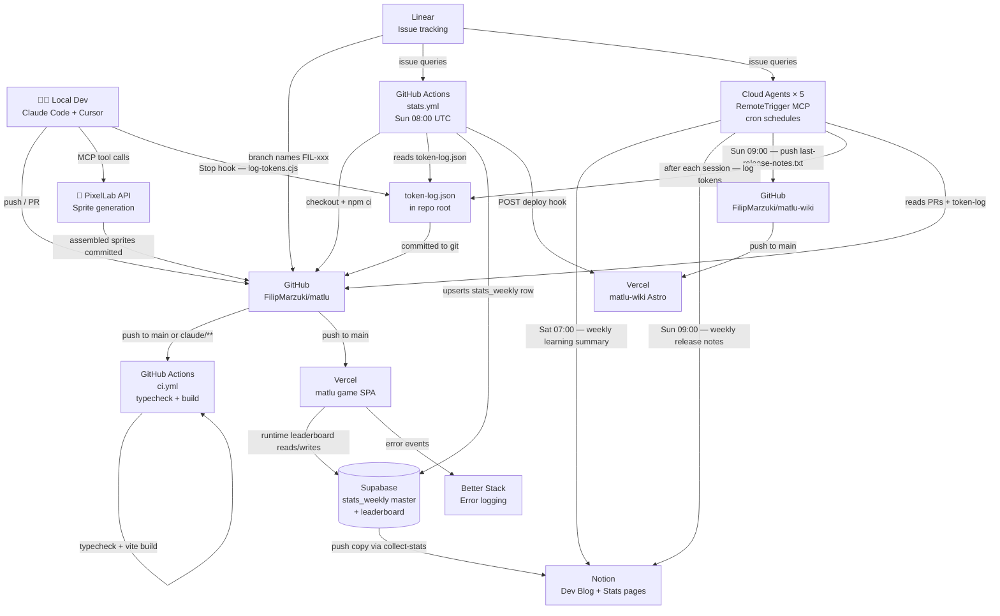

# Matlu — Infrastructure

## Diagram



---

## Services

### Vercel — matlu (game)
- **URL**: auto-assigned by Vercel, production branch = `main`
- **Build**: `tsc && vite build`
- **Triggers**: every push to `main`
- **Env vars needed**: `VITE_SUPABASE_URL`, `VITE_SUPABASE_PUBLISHABLE_DEFAULT_KEY`

### Vercel — matlu-wiki (Astro blog)
- **Repo**: `FilipMarzuki/matlu-wiki`
- **Static site**: reads Notion Dev Blog child pages at build time via `src/lib/notion.ts → getBlogPosts()`
- **Triggers**: push to `main` on matlu-wiki repo, OR webhook POST from `stats.yml`
- **Env vars needed**: `NOTION_API_KEY`, `NOTION_BLOG_PAGE_ID`

### Supabase
- **Table**: `public.matlu_runs` — leaderboard entries
- **Access**: anon/authenticated RLS allows `select` + `insert`
- **Client**: browser-only (`@supabase/supabase-js`, no SSR)
- **Schema**: managed via `apply_migration`; types in `src/types/database.types.ts`

### Linear
- **Project**: Matlu, assignee Filip Marzuki
- **Branch convention**: `FIL-<number>-<slug>` — stats pipeline uses this to attribute token costs to issues
- **Agent branches**: `claude/<issue-slug>` — agent PR ratio tracked in weekly stats

### Notion
- **Dev Blog**: weekly learning summaries + release notes (from cloud agents)
- **Stats page**: pushed from Supabase by `collect-stats.js` after the Supabase upsert — Supabase is the master, Notion is a read-friendly copy
- **API version**: `2022-06-28`; pages created as children of `NOTION_STATS_PAGE_ID`

### PixelLab
- **API**: `https://api.pixellab.ai/v1`
- **Balance endpoint**: `GET /v1/balance` → `{ "type": "usd", "usd": float }`
- **Used for**: sprite and tileset generation via MCP tools in Claude Code
- **Credits**: reset monthly on the 9th

### Better Stack
- **Used for**: runtime error capture from the live game
- **Client**: `@logtail/browser` in `src/lib/logger.ts`

---

## GitHub Actions Workflows

### `ci.yml` — Continuous Integration
**Triggers**: push to `main`, push to `claude/**`, PRs targeting `main`

```
checkout → node 20 → npm ci → tsc --noEmit → vite build
```

Placeholder env vars set for Vite (`VITE_SUPABASE_*`) so build succeeds without secrets.

### `stats.yml` — Weekly Engineering Stats
**Trigger**: Sunday 08:00 UTC (+ manual `workflow_dispatch`)

```
checkout → node 20 → npm ci → node .github/scripts/collect-stats.js
```

**Collects**:
| Section | Source |
|---|---|
| Delivery | GitHub PRs, Linear issues |
| Velocity | PR merge times, Linear cycle times |
| Quality | CI pass rate, fix/revert PR count |
| Automation | Agent vs human PR ratio, agent success rate |
| Hotspots | Top 5 most-changed files (from PR file diffs) |
| In Progress (stale) | Linear tickets in "started" state, sorted by days since update |
| AI Usage | `token-log.json` — sessions, tokens, cost by model + feature |
| Code Quality | grep: `as any`, `@ts-ignore`, TODO/FIXME/HACK; git log: net lines |
| Bundle Size | `npm run build` output parsed for JS/CSS kB |
| PixelLab Credits | `GET /v1/balance` |
| Deployment Frequency | Vercel REST API — production deploys this week vs last week |

**Secrets required**:
```
NOTION_API_KEY
NOTION_STATS_PAGE_ID
PIXELLAB_API_KEY
VERCEL_DEPLOY_HOOK        (optional — triggers matlu-wiki rebuild)
VERCEL_TOKEN              (optional — read production deployments from Vercel)
VERCEL_PROJECT_ID         (optional — Vercel project to query)
```

---

## Cloud Agents (RemoteTrigger MCP)

Five agents running on Anthropic's infrastructure, each triggered by a cron schedule:

| ID | Schedule | Role |
|---|---|---|
| `trig_01L86hN6q2VCXgWXM8jsVswk` | Sat 07:00 UTC | Weekly learning summary → Notion Dev Blog |
| `trig_01NmRRzzoMpD2uQBVN3TBeGt` | Sun 09:00 UTC | Weekly release notes → Notion + matlu-wiki push |
| `trig_01TBjH1xRJ73iqi4FiSFeExB` | (scheduled) | Feature implementation |
| `trig_018h2KaspR1UfqyJs2L2J846` | (scheduled) | Feature implementation |
| `trig_01RrNzZw22rZLL7wLQQubhAy` | (scheduled) | Feature implementation |

All agents end their session with `npm run log-tokens` to commit token usage to `token-log.json`.

---

## Token Tracking

**`token-log.json`** (committed to repo root) — accumulates one entry per Claude Code session:

```json
{
  "sessionId": "uuid",
  "date": "2026-04-11",
  "branch": "claude/146-choice-tracking-endings",
  "issueId": "#146",
  "model": "claude-sonnet-4-6",
  "source": "claude-code",
  "inputTokens": 12000,
  "outputTokens": 3000,
  "cacheReadTokens": 140000,
  "cacheWriteTokens": 500,
  "estimatedCostUsd": 0.0535
}
```

**Written by**:
- Local sessions: `.claude/settings.json` Stop hook → `node .github/scripts/log-tokens.cjs`
- Cloud agents: final step in each trigger prompt → `npm run log-tokens`
- Manual (Cursor): `node .github/scripts/log-tokens.cjs --manual 148 45000 8000`

**Read by**: `stats.yml` → `collect-stats.js → getAiStats()` for weekly AI usage section.

---

## Secrets Reference

| Secret | Used by | Description |
|---|---|---|
| `GITHUB_TOKEN` | `stats.yml` (auto) | GitHub API — PRs, CI runs, commits |
| `NOTION_API_KEY` | `stats.yml`, cloud agents | Post pages to Notion |
| `NOTION_STATS_PAGE_ID` | `stats.yml` | Parent page for weekly stats children |
| `PIXELLAB_API_KEY` | `stats.yml` | Balance endpoint |
| `VERCEL_DEPLOY_HOOK` | `stats.yml` | POST to rebuild matlu-wiki after stats |
| `VERCEL_TOKEN` | `stats.yml` | Vercel personal access token — read production deployments for DORA metrics |
| `VERCEL_PROJECT_ID` | `stats.yml` | Vercel project ID — identifies which project to query for deployment history |
| `VITE_SUPABASE_URL` | CI + stats (placeholder) | Build-time placeholder |
| `VITE_SUPABASE_ANON_KEY` | CI + stats (placeholder) | Build-time placeholder |
| `VITE_SUPABASE_PUBLISHABLE_DEFAULT_KEY` | CI + stats (placeholder) | Build-time placeholder |
