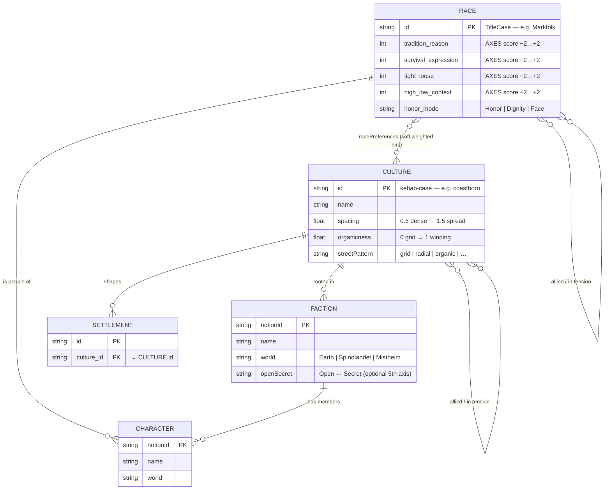

# Race, Culture, and Faction — Information Model

This document describes the taxonomy of the three core organisational entities in the
Matlu world and how they relate to each other and to Characters and Settlements in code.

## The three core entities

| Entity | Canonical home | ID format | Notes |
|--------|---------------|-----------|-------|
| **Race (People)** | `WORLD.md`, scored in `AXES.md` | TitleCase — e.g. `Markfolk` | 15 Mistheim Peoples; race-agnostic from culture's perspective |
| **Culture** | `macro-world/cultures.json` | kebab-case — e.g. `coastborn` | Settlement style (geometry, feel); many Peoples can share one culture |
| **Faction** | Notion Factions DB | Notion UUID | Organisations across all three worlds; scored on the same cultural axes |
| **Character** | Notion Characters DB | Notion UUID | Named NPCs, antagonists, allies |

## Information model

**Legend**

| Notation | Meaning |
|----------|---------|
| `\|\|--o{` | exactly one → zero-or-many |
| `}o--o{` | zero-or-many ↔ zero-or-many |
| `}o--\|\|` | zero-or-many → exactly one |

## Relations

**Race → Character** (`||--o{`)
Every Character belongs to exactly one People. A People can have zero or many Characters in the Notion DB.

**Race ↔ Culture** (`}o--o{`)
Cultures are race-agnostic by design — the `racePreferences` field in `cultures.json` is a soft weighted hint to the settlement generator, not a strict membership. Zero or more Peoples may appear in a culture's preferences; a People may appear in many cultures' preference lists.

**Race ↔ Race** (`}o--o{`)
Inter-People relations (allied, in tension) are documented in `WORLD.md` per People. These are narrative relations, not a hard FK; both ends are optional (some Peoples have no documented alliances yet).

**Culture → Settlement** (`||--o{`)
Each Settlement is shaped by exactly one Culture (its `culture_id`). A Culture may shape many Settlements. This is the code-level settlement-culture binding — the artifact that drives layout geometry and building placement.

**Culture → Faction** (`||--o{`)
A Faction is rooted in one Culture (its organisational style and norms). A Culture may be home to many Factions. If a Faction spans cultural boundaries, record the primary cultural anchor.

**Culture ↔ Culture** (`}o--o{`)
Allied or tense inter-culture relations documented in lore. Optional on both ends.

**Faction → Character** (`||--o{`)
A Faction has zero or many member Characters. A Character belongs to exactly one Faction (their primary affiliation; secondary ties are captured in Character lore text, not this model).

## Source of truth

| What | Where |
|------|-------|
| Race IDs + lore baseline | `WORLD.md` → 15 Mistheim Peoples |
| Race cultural-axes scores | `AXES.md` |
| Culture definitions (code) | `macro-world/cultures.json` |
| Culture traits registry | `macro-world/culture-traits.json` |
| Race → Culture mapping (historical) | `docs/peoples-and-races.md` |
| Faction + Character entries | Notion (`LORE.md` has DB IDs) |
